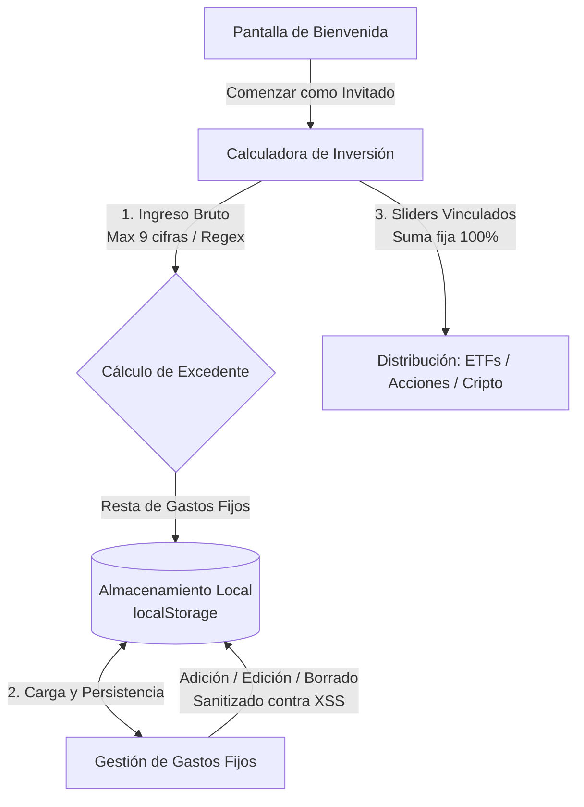

# Money To Invest 💰

Una calculadora de inversión inteligente y planificador de gastos fijos mensual de grado premium, rápida y segura, diseñada para funcionar 100% en el navegador y alojada en **GitHub Pages**.

---

## 📊 Arquitectura y Flujo de Datos

El siguiente gráfico explica el flujo de datos seguro y local de la aplicación:

---

## 🔐 Pilares de Seguridad (OWASP Top 10 Web)

La aplicación está estructurada para mitigar riesgos cibernéticos del lado del cliente:

*   **A03:2021-Injection (Inyección y Sanitización):** Todos los ingresos y montos de gastos se filtran mediante expresiones regulares (`/[^0-9.]/g`) para evitar inyecciones XSS. Se aplica un **límite estricto de 9 cifras enteras** para prevenir fallos de desbordamiento de memoria y ataques de Denegación de Servicio (DoS) por sobrecarga de procesamiento en bucles de cálculo del navegador.
*   **A02:2021-Cryptographic Failures (Datos Sensibles):** No se envían datos financieros por red ni se almacenan credenciales en bases de datos inseguras. La persistencia se realiza localmente en la máquina del usuario mediante `localStorage` de forma privada.
*   **A05:2021-Security Misconfiguration:** Configuración estática limpia y libre de claves de desarrollo o secretos expuestos en producción.

---

## 🚀 Tecnologías

*   **Core:** React 19 + TypeScript + Vite.
*   **Diseño:** Vanilla CSS (glassmorphism moderno, diseño obsidian dark responsivo y sliders re-estilizados desde cero).
*   **Iconos:** Lucide React.
*   **Despliegue:** GitHub Actions CI/CD.
