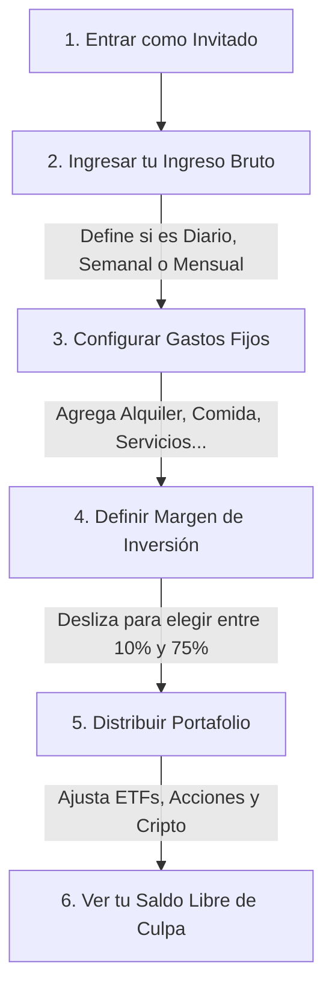

# Money To Invest 💰

**Money To Invest** es tu planificador financiero personal. Esta herramienta interactiva y privada te ayuda a visualizar tus ingresos, gestionar tus gastos fijos mensuales y estructurar un portafolio de inversión inteligente con el excedente de tu dinero.

---

## 📈 ¿Cómo funciona? (Flujo de Uso)

El siguiente diagrama muestra el camino sencillo para organizar tus finanzas en la aplicación:

---

## 📘 Guía Paso a Paso para el Usuario

Sigue estos pasos para sacar el máximo provecho de la calculadora y educar tu salud financiera:

### Paso 1: Ingresa tu Monto y Periodo
En la pantalla principal, selecciona tu periodo de ingresos (diario, semanal o mensual) y escribe la cantidad de dinero que percibes. 
*   *Consejo de Seguridad:* Los campos tienen un **límite máximo de 9 cifras** para evitar errores tipográficos gigantes y asegurar cálculos exactos.

### Paso 2: Administra tus Gastos Fijos
Haz clic en la tarjeta de **Gastos Fijos** o usa el menú de navegación inferior. Aquí verás una lista por defecto de los gastos comunes (alimentación, combustible, servicios).
*   **Modifica** los montos directamente.
*   **Elimina** los gastos que no apliquen a tu estilo de vida.
*   **Agrega** gastos personalizados con un concepto y una descripción rápida.
*   *Nota:* Al hacer clic en **"Guardar y Volver"**, el sistema restará automáticamente tus gastos de tu ingreso de acuerdo al periodo seleccionado, mostrándote tu **Excedente** real (el dinero que te sobra después de pagar tus obligaciones).

### Paso 3: Define cuánto quieres Invertir
Usa la tarjeta interactiva central (con el porcentaje resaltado en verde) para decidir qué fracción de tu excedente quieres invertir. 
*   Puedes arrastrar el slider entre el **10%** (inversión conservadora) y el **75%** (inversión agresiva).

### Paso 4: Distribuye tus Inversiones
En la sección **Distribución del Portafolio**, puedes repartir tu monto de inversión en tres pilares clásicos:
*   **ETFs (Fondos Indexados):** Inversiones diversificadas a largo plazo.
*   **Acciones:** Participaciones en empresas específicas.
*   **Cripto:** Activos digitales de alta volatilidad.
*   *Lógica Inteligente:* Los tres sliders están vinculados. Al mover uno, los otros dos se adaptan de forma proporcional para asegurar que **la suma total siempre sea exactamente el 100%** de tu dinero destinado a inversión.

### Paso 5: Conoce tu Saldo Libre de Culpa
Al final de la pantalla, verás reflejado tu **Saldo Restante**. Este es el dinero que te queda disponible para gastar en entretenimiento, salidas o metas personales de ahorro a corto plazo. ¡Gástalo sin culpa sabiendo que tus gastos están pagados y tus inversiones del mes ya están calculadas!

---

## 🔒 Privacidad y Control Total
*   **100% Privado:** Tus números y finanzas no se guardan en ningún servidor externo ni se comparten con nadie. Toda la información se guarda exclusivamente en la base de datos local de tu navegador web (`localStorage`).
*   **Sin Registros Compilados:** Puedes usar la aplicación al instante sin formularios ni inicios de sesión tediosos.
